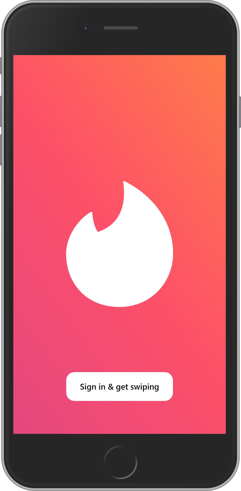

# Tinder Clone

[Tinder clone](https://tinder.com) using [react native](https://reactnative.dev/), [tailwind css](https://www.npmjs.com/package/tailwind-rn) and [firebase](https://firebase.google.com/). Based on this [tutorial](https://www.youtube.com/watch?v=qJaFIGjyRms).

## Installation

Install modules:

```bash
yarn
```

you need to link it to a firebase project and a google account api key following the instructions on this [tutorial](https://www.youtube.com/watch?v=qJaFIGjyRms).

you need a .env with the following values:

```bash
ANDROID_CLIENT_ID=
IOS_CLIENT_ID=
EXPO_CLIENT_ID=
WEB_CLIENT_ID=
FIREBASE_API_KEY=
FIREBASE_AUTH_DOMAIN=
FIREBASE_PROJECT_ID=
FIREBASE_STORAGE_BUCKET=
FIREBASE_MESSAGING_SENDER_ID=
FIREBASE_APP_ID=
FIREBASE_MEASUREMENT_ID=
```

along with the .env files you will need to add to the root of the project the google-services.json and GoogleService-Info.plist files that you get when creating the firebase project and the google cloud project.

## Development

- Run this command in a terminal

```bash
expo start

or

yarn start
```

- Run this command in another terminal

```bash
yarn dev:tailwind
```

## Images

<p align="center">
   
</p>

<p align="center">
   
</p>

<p align="center">
   
</p>

<p align="center">
   
</p>

<p align="center">
   
</p>

<p align="center">
   
</p>
